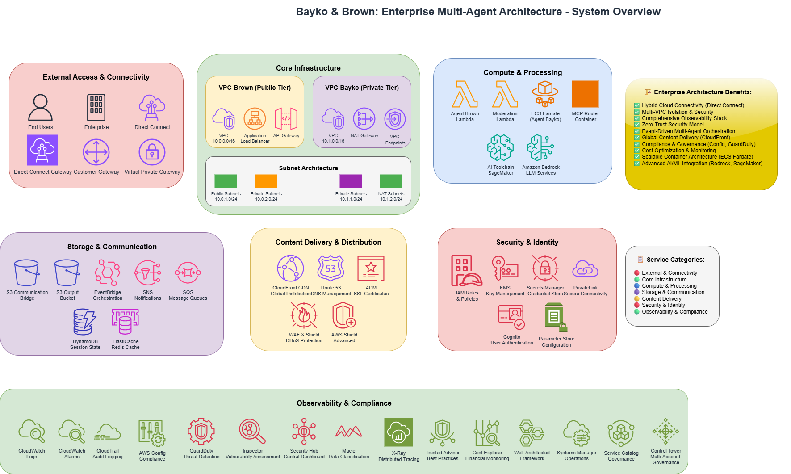

# Networking Fundamentals Bootcamp 2025 — Custom Architecture Track

**Instructor: Andrew Brown & Tim McConnaughy**

This repository documents my work in the 2025 Networking Fundamentals Bootcamp.
**I intentionally diverged from the standard demo project** to design a custom cloud-native architecture that demonstrates all required networking fundamentals through an enterprise-style AI orchestration system.

---

## 🧠 Architecture at a Glance

This high-level architecture showcases the components and AWS services used to implement zero-trust, VPC-isolated AI orchestration across multiple domains.



---

## 🔧 Project: Bayko & Brown — Secure Multi-Agent Orchestration System

A zero-trust, multi-agent system designed for enterprise AI workflows across isolated VPCs.

Key networking principles demonstrated:

- **VPC Isolation** — Brown (Public VPC) and Bayko (Private VPC)
- **Cross-VPC Communication** — via S3 and EventBridge
- **Zero Trust** — No direct communication between agents
- **IAM Role Separation** — Scoped permissions for all agent roles
- **Event-Driven Architecture** — Asynchronous task processing with traceability

---

## 📊 Bootcamp Topics → Real Implementation

| **Bootcamp Topic**      | **My Implementation**                        |
| ----------------------- | -------------------------------------------- |
| VPC Design              | Dual-VPC layout (10.0.x.x / 10.1.x.x)        |
| Firewall Rules          | Security groups with Layer 4 isolation       |
| IP Address Management   | Subnets with clear CIDR allocations          |
| NAT Gateway             | NAT for outbound-only traffic in public tier |
| Load Balancer           | ALB routes traffic to Agent Brown            |
| Network Monitoring      | CloudWatch logs + output metrics             |
| Traffic Flow            | EventBridge + S3 coordination                |
| Zero Trust Architecture | No runtime agent-to-agent communication      |

---

## 🧱 Core Components

- **Agent Brown (Public VPC):** Input validation, tagging, routing
- **Agent Bayko (Private VPC):** Tool orchestration, processing, output assembly
- **S3 Communication Bridge:** Message handoff between agents
- **EventBridge Orchestration:** Decoupled agent triggers
- **CloudFront CDN (Optional):** Secure delivery of artifacts

---

## 📁 Repository Structure

```
├── projects/
│   ├── 00-architecture/
│   │   ├── README.md                 # Project-specific readme
│   │   ├── architecture.md           # System design and diagrams
│   │   ├── agents.md                 # Agent logic and behavior
│   │   ├── performance_considerations.md
│   │   └── enterprise-scenario.md   # Real-world alignment scenarios
│   ├── 01-week1/
│   └── 02-week2/
├── journal/
│   └── 00-architecture/
├── notes/
│   ├── glossary.md
│   └── OSI-babas-chakras.md
└── README.md  # This file
```

---

## ✅ Compliance Summary

This custom project satisfies all required networking fundamentals:

- [x] VPC/Subnet design
- [x] Firewall configuration and SG rules
- [x] Cross-network service coordination
- [x] Load balancer integration
- [x] Event-driven communication
- [x] Monitoring and observability
- [x] Zero-trust implementation

---

## 🧠 Learning Highlights

- Designed and documented multi-agent network architecture
- Applied zero-trust design to AWS cloud networking
- Implemented asynchronous orchestration using S3 + EventBridge
- Demonstrated production-grade isolation and security patterns
- Mapped bootcamp topics to real-world infrastructure

---

**Built by Ramsi Kalia** · [LinkedIn](https://linkedin.com/in/ramsikalia)
