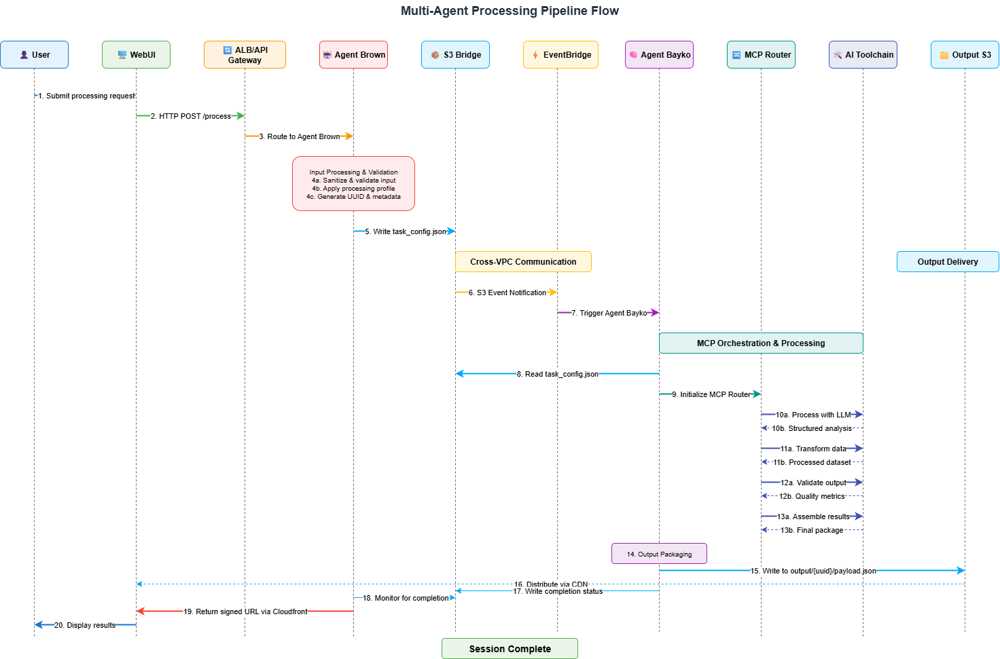

# Bayko & Brown: Multi-Agent Orchestration System

_Production-grade AI agents that can't talk to each other (by design)._

---

## 🚀 Why This Matters

Ever wondered how enterprise AI systems handle security? This project demonstrates **zero-trust multi-agent architecture** where AI agents are completely isolated but still coordinate seamlessly through AWS infrastructure.

**Perfect for:**

- 🏢 Enterprise environments requiring agent isolation
- 🔒 Compliance-heavy industries (finance, healthcare, government)
- 🎓 Learning advanced AWS networking patterns
- 🛡️ Understanding zero-trust AI architecture

---

## 🎯 Project Overview

This project showcases a **multi-agent orchestration system** featuring two isolated agents operating in separate VPCs, coordinated via S3 and EventBridge. The system enforces **zero direct communication**, relying on **event-driven task execution** and strict IAM boundaries.

**Key Architecture Principles:**

- 🚫 **Zero Direct Communication**: Agents never talk directly
- 🔐 **VPC-Level Isolation**: Complete network separation
- 📦 **S3 as Message Bus**: Secure, auditable data handoff
- ⚡ **Event-Driven**: EventBridge orchestrates everything
- 🛡️ **IAM Boundaries**: Least-privilege security model

**Tech Stack:** AWS VPC, Lambda, ECS, S3, EventBridge, CloudFront

---

## 🏗️ How It Works



**The Flow:**

1. **User** submits request → **Agent Brown** (public VPC)
2. **Brown** validates input → writes to **S3**
3. **S3** triggers **EventBridge** → wakes up **Agent Bayko** (private VPC)
4. **Bayko** processes task → writes output to **S3**
5. **CloudFront** delivers results → **User**

**The Magic:** Agents never communicate directly, yet the system works seamlessly.

---

## 🧱 Core Components

- **Agent Brown (Public VPC)**: Input validation, metadata tagging, request submission
- **Agent Bayko (Private VPC)**: Tool orchestration, quality validation, output generation
- **S3 Communication Bridge**: Cross-VPC task handoff with signed payloads
- **EventBridge**: Triggers Bayko based on S3 activity
- **CloudFront (Optional)**: Output distribution with signed URLs

---

## 🔐 Security Model

- No agent-to-agent communication
- S3 used as an air-gapped transport mechanism
- EventBridge isolates execution control
- IAM separation and scoped permissions per role
- VPC-level firewall isolation (Layer 4)

---

## 🧰 Internal Routing System (Bayko)

Bayko uses a task router to:

- Select tools based on processing profile
- Handle failure fallbacks
- Track quality metrics and generate structured outputs

---

## 📖 Explore the Architecture

| Document                                                           | What You'll Learn                                |
| ------------------------------------------------------------------ | ------------------------------------------------ |
| [`architecture.md`](./architecture.md)                             | Complete system diagrams and AWS service details |
| [`agents.md`](./agents.md)                                         | How Brown and Bayko actually work                |
| [`performance-considerations.md`](./performance-considerations.md) | Real-world latency and scaling expectations      |
| [`enterprise-applications.md`](./enterprise-applications.md)       | Finance, healthcare, and government use cases    |

---

## 🧪 Example Task Payload

```json
{
  "input": "Process quarterly data analysis request",
  "processing": {
    "agent_brown": "Validation, tagging, submission",
    "agent_bayko": "Processing, validation, output packaging"
  },
  "output": {
    "artifacts": [
      "output_payload.json",
      "processing.log",
      "quality_metrics.json"
    ],
    "metrics": {
      "processing_time": "45.2s",
      "tools_used": ["claude", "data-processor"]
    },
    "delivery": "CloudFront (signed URL)"
  }
}
```

---

## 🎯 Real-World Applications

**Financial Services**: SOX-compliant risk analysis with complete audit trails
**Healthcare**: HIPAA-ready patient data processing with zero data leakage  
**Government**: Air-gapped intelligence analysis for classified environments
**Manufacturing**: Proprietary process optimization with IP protection

## 🎓 Learning Outcomes

This project demonstrates:

- ✅ Advanced AWS VPC design patterns
- ✅ Zero-trust architecture principles
- ✅ Event-driven system orchestration
- ✅ Enterprise security and compliance
- ✅ Multi-agent AI system design

---

_Built by Ramsi Kalia · Networking Fundamentals Bootcamp 2025 · [LinkedIn](https://linkedin.com/in/ramsikalia)_
