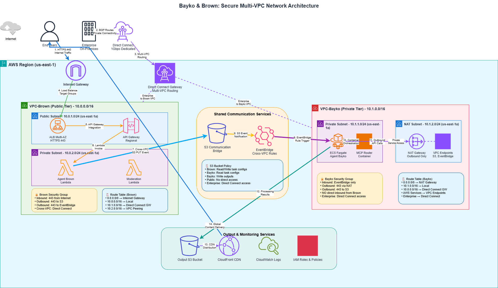
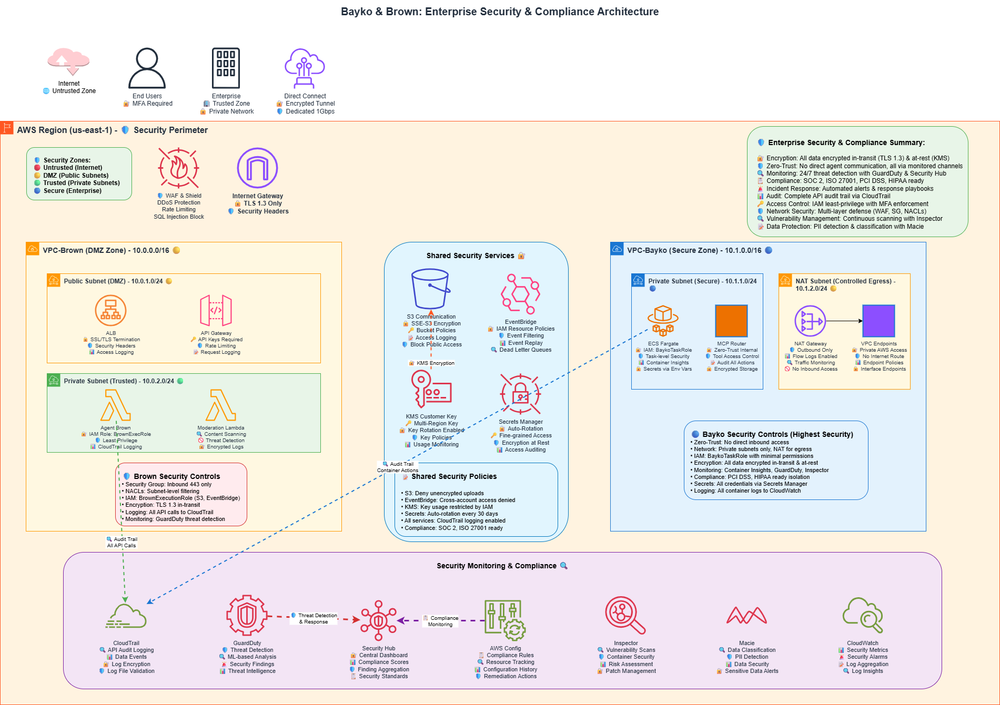
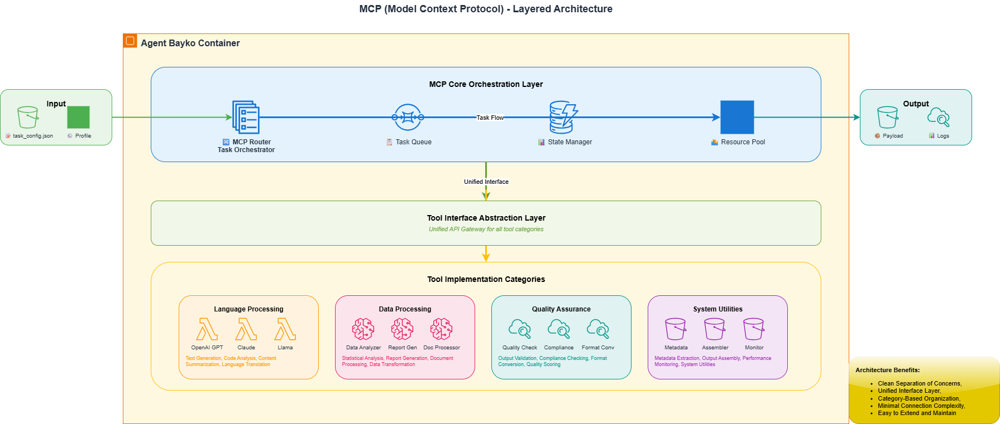
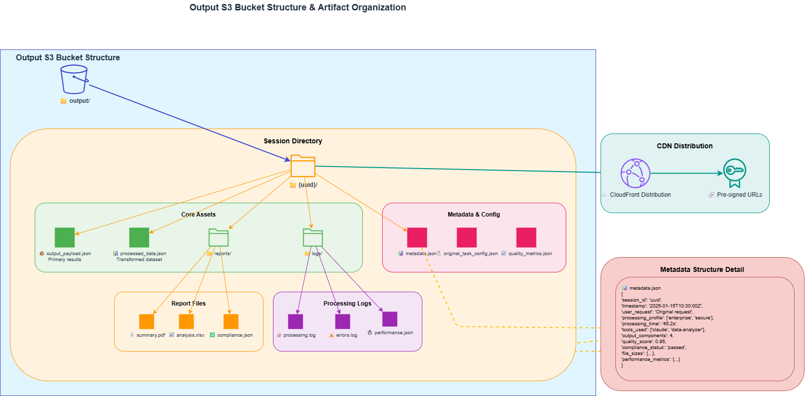
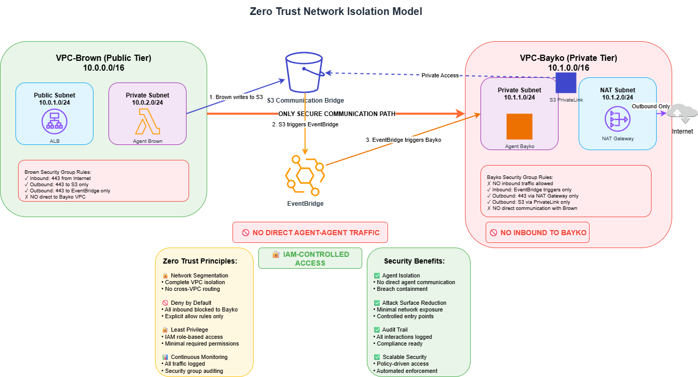

# 🧠 System Architecture – Bayko & Brown: Multi-Agent Orchestration Platform

> _Production-grade multi-agent system with secure VPC isolation, event-driven workflows, and modular AI toolchain orchestration for enterprise LLMOps._

This document presents the finalized system architecture for the Bayko & Brown multi-agent platform. It includes production-ready diagrams showing agent isolation, inter-VPC communication, and secure orchestration across a distributed AI pipeline.

The architecture emphasizes:

- Secure networking and IAM isolation
- Asynchronous, event-driven processing
- Modular AI toolchains routed via the Bayko Task Router (formerly referred to as MCP)
- Traceable output, observability, and compliance enforcement

All architecture diagrams below are finalized `.drawio` PNGs. Legacy Mermaid drafts have been archived in [`mermaid-archive.md`](./mermaid-archive.md) for reference.

---

## 1. System Overview

High-level architecture showing user entry point, agent segmentation, and top-level cloud components.

---

## 2. Network Architecture

VPC layout and subnet structure for public/private isolation, NAT routing, and shared services.

---

## 3. Security Architecture

IAM boundaries, execution roles, and enforcement of zero-trust principles across agents.

---

## 4. MCP Subsystem

Internal structure of Bayko’s orchestration engine — including routing, tool registry, and processing interfaces.

---

## 5. Output Artifact Structure

Folder and file structure of output artifacts in S3, including payloads, reports, logs, and quality metadata.

---

## 6. Agent Flow

End-to-end message flow from user input through Brown, S3, EventBridge, Bayko, and back to the user.

---

## 7. Zero-Trust Isolation

Final network enforcement layer showing complete VPC isolation, restricted communication paths, and IAM enforcement zones.

---
