# 🧠 System Architecture – Bayko & Brown: Multi-Agent Orchestration Platform

**One-line summary:** _Production-grade multi-agent system with secure VPC isolation, event-driven workflows, and modular AI toolchain orchestration for enterprise LLMOps._

This document presents the comprehensive system architecture, agent orchestration patterns, and network security design of the Bayko & Brown multi-agent platform.

---

## System Overview

This document presents the comprehensive system architecture for **Bayko & Brown Multi-Agent Orchestration Platform**, a production-ready AI workflow system that demonstrates secure agent isolation, modular tool orchestration, and enterprise-grade infrastructure design. The system showcases advanced AWS networking principles including VPC design, cross-VPC communication, subnet isolation, and event-driven workflows.

---

## 1. System Architecture Overview

The complete system architecture showcases the interaction between user interfaces, AI agents, and cloud infrastructure components across isolated network boundaries.

```mermaid
graph TB
    subgraph "External Access"
        User[👤 User]
        WebUI[🖥️ WebUI Interface]
    end

    subgraph "VPC-Brown (Public Tier)"
        ALB[🔄 Application Load Balancer]
        AGW[🌐 API Gateway]
        Brown[🤖 Agent Brown<br/>Input Validator & Router]
        ModLambda[🛡️ Moderation Lambda]
    end

    subgraph "Shared Communication Layer"
        S3Bridge[📦 S3 Communication Bridge<br/>task_config.json]
        EventBridge[⚡ EventBridge Triggers]
    end

    subgraph "VPC-Bayko (Private Tier)"
        Bayko[🧠 Agent Bayko<br/>MCP Orchestrator]
        MCPRouter[🔀 MCP Router]

        subgraph "AI Toolchain"
            LLM[🤖 Language Models]
            DataProcessor[📊 Data Processor]
            Validator[✅ Quality Validator]
            Assembler[🔧 Output Assembler]
        end

        NAT[🌐 NAT Gateway]
    end

    subgraph "Output & Delivery"
        OutputS3[📁 Output S3 Bucket]
        CloudFront[☁️ CloudFront CDN]
    end

    subgraph "Monitoring & Security"
        CloudWatch[📊 CloudWatch Logs]
        IAM[🔐 IAM Roles & Policies]
    end

    %% External Flow
    User --> WebUI
    WebUI --> ALB
    ALB --> AGW
    AGW --> Brown

    %% Cross-VPC Communication
    Brown --> S3Bridge
    Brown --> ModLambda
    S3Bridge --> EventBridge
    EventBridge --> Bayko

    %% Internal Bayko Processing
    Bayko --> MCPRouter
    MCPRouter --> LLM
    MCPRouter --> DataProcessor
    MCPRouter --> Validator
    MCPRouter --> Assembler

    %% Output Flow
    Bayko --> OutputS3
    OutputS3 --> CloudFront
    CloudFront --> WebUI

    %% Network & Security
    Bayko --> NAT
    Brown --> CloudWatch
    Bayko --> CloudWatch
    IAM -.-> Brown
    IAM -.-> Bayko

    classDef publicTier fill:#e1f5fe
    classDef privateTier fill:#f3e5f5
    classDef sharedLayer fill:#fff3e0
    classDef aiTools fill:#e8f5e8

    class ALB,AGW,Brown,ModLambda publicTier
    class Bayko,MCPRouter,NAT privateTier
    class S3Bridge,EventBridge sharedLayer
    class LLM,DataProcessor,Validator,Assembler aiTools
```



---

## 2. Agent Processing Flow

This diagram illustrates the complete data flow and processing pipeline from user input to final output delivery.


---

## 3. MCP Subsystem Architecture

The Model Context Protocol (MCP) serves as Bayko's internal orchestration engine, routing tasks to appropriate tools and managing the processing pipeline.

```mermaid
graph TB
    subgraph "Agent Bayko Container"
        subgraph "MCP Core System"
            MCPRouter[🔀 MCP Router<br/>Task Orchestrator]
            TaskQueue[📋 Task Queue]
            StateManager[📊 State Manager]
            ResourcePool[🏊 Resource Pool]
        end

        subgraph "Tool Interfaces"
            LLMInterface[🤖 LLM Interface]
            ProcessingInterface[📊 Processing Interface]
            ValidationInterface[✅ Validation Interface]
            UtilInterface[🛠️ Utility Interface]
        end

        subgraph "Tool Implementations"
            subgraph "Language Processing"
                OpenAI[OpenAI GPT]
                Claude[Anthropic Claude]
                Llama[Meta Llama]
            end

            subgraph "Data Processing"
                DataAnalyzer[Data Analyzer]
                ReportGenerator[Report Generator]
                DocumentProcessor[Document Processor]
            end

            subgraph "Quality Assurance"
                QualityChecker[Quality Checker]
                ComplianceValidator[Compliance Validator]
                FormatConverter[Format Converter]
            end

            subgraph "Utilities"
                MetadataExtractor[Metadata Extractor]
                OutputAssembler[Output Assembler]
                PerformanceMonitor[Performance Monitor]
            end
        end
    end

    subgraph "External Inputs"
        TaskConfigJSON[📝 task_config.json]
        UserPrefs[⚙️ Processing Profile]
    end

    subgraph "External Outputs"
        OutputPayload[📦 Output Payload]
        Metadata[📋 Processing Metadata]
        Logs[📊 Process Logs]
    end

    %% Input Flow
    TaskConfigJSON --> MCPRouter
    UserPrefs --> MCPRouter

    %% Core MCP Flow
    MCPRouter --> TaskQueue
    TaskQueue --> StateManager
    StateManager --> ResourcePool
    ResourcePool --> MCPRouter

    %% Tool Routing
    MCPRouter --> LLMInterface
    MCPRouter --> ProcessingInterface
    MCPRouter --> ValidationInterface
    MCPRouter --> UtilInterface

    %% Interface to Implementation Mapping
    LLMInterface --> OpenAI
    LLMInterface --> Claude
    LLMInterface --> Llama

    ProcessingInterface --> DataAnalyzer
    ProcessingInterface --> ReportGenerator
    ProcessingInterface --> DocumentProcessor

    ValidationInterface --> QualityChecker
    ValidationInterface --> ComplianceValidator
    ValidationInterface --> FormatConverter

    UtilInterface --> MetadataExtractor
    UtilInterface --> OutputAssembler
    UtilInterface --> PerformanceMonitor

    %% Output Generation
    MCPRouter --> OutputPayload
    StateManager --> Metadata
    MCPRouter --> Logs

    classDef mcpCore fill:#e3f2fd
    classDef interfaces fill:#f1f8e9
    classDef langTools fill:#fff3e0
    classDef processTools fill:#fce4ec
    classDef validationTools fill:#e0f2f1
    classDef utilTools fill:#f3e5f5

    class MCPRouter,TaskQueue,StateManager,ResourcePool mcpCore
    class LLMInterface,ProcessingInterface,ValidationInterface,UtilInterface interfaces
    class OpenAI,Claude,Llama langTools
    class DataAnalyzer,ReportGenerator,DocumentProcessor processTools
    class QualityChecker,ComplianceValidator,FormatConverter validationTools
    class MetadataExtractor,OutputAssembler,PerformanceMonitor utilTools
```



---

## 4. Output Artifact Structure

This diagram shows the comprehensive structure of generated workflow outputs and associated metadata.

```mermaid
graph TB
    subgraph "Output S3 Bucket Structure"
        Root[📁 output/]

        subgraph "Session Directory"
            SessionDir[📁 {uuid}/]

            subgraph "Core Assets"
                OutputPayload[📦 output_payload.json<br/>Primary results]
                ProcessedData[📊 processed_data.json<br/>Transformed dataset]
                ReportsDir[📁 reports/]
                LogsDir[📁 logs/]
            end

            subgraph "Report Files"
                SummaryReport[📄 summary.pdf]
                DetailedAnalysis[📈 analysis.xlsx]
                ComplianceReport[✅ compliance.json]
            end

            subgraph "Processing Logs"
                ProcessingLog[📝 processing.log]
                ErrorLog[⚠️ errors.log]
                PerformanceLog[⏱️ performance.json]
            end

            subgraph "Metadata & Config"
                MetaJSON[📊 metadata.json]
                TaskConfig[📋 original_task_config.json]
                QualityMetrics[📈 quality_metrics.json]
            end
        end

        subgraph "CDN Distribution"
            CloudFrontDist[☁️ CloudFront Distribution]
            SignedURLs[🔗 Pre-signed URLs]
        end
    end

    subgraph "Metadata Structure Detail"
        MetaDetail["📊 metadata.json<br/>{<br/>  'session_id': 'uuid',<br/>  'timestamp': '2025-01-15T10:30:00Z',<br/>  'user_request': 'Original request',<br/>  'processing_profile': ['enterprise', 'secure'],<br/>  'processing_time': '45.2s',<br/>  'tools_used': ['claude', 'data-analyzer'],<br/>  'output_components': 4,<br/>  'quality_score': 0.95,<br/>  'compliance_status': 'passed',<br/>  'file_sizes': {...},<br/>  'performance_metrics': {...}<br/>}"]
    end

    Root --> SessionDir
    SessionDir --> OutputPayload
    SessionDir --> ProcessedData
    SessionDir --> ReportsDir
    SessionDir --> LogsDir
    SessionDir --> MetaJSON
    SessionDir --> TaskConfig
    SessionDir --> QualityMetrics

    ReportsDir --> SummaryReport
    ReportsDir --> DetailedAnalysis
    ReportsDir --> ComplianceReport

    LogsDir --> ProcessingLog
    LogsDir --> ErrorLog
    LogsDir --> PerformanceLog

    SessionDir --> CloudFrontDist
    CloudFrontDist --> SignedURLs

    MetaJSON -.-> MetaDetail

    classDef directories fill:#e1f5fe
    classDef coreFiles fill:#e8f5e8
    classDef reportFiles fill:#fff3e0
    classDef logFiles fill:#f3e5f5
    classDef metaFiles fill:#fce4ec
    classDef cdn fill:#e0f2f1

    class Root,SessionDir,ReportsDir,LogsDir directories
    class OutputPayload,ProcessedData,QualityMetrics coreFiles
    class SummaryReport,DetailedAnalysis,ComplianceReport reportFiles
    class ProcessingLog,ErrorLog,PerformanceLog logFiles
    class MetaJSON,TaskConfig metaFiles
    class CloudFrontDist,SignedURLs cdn
```

---

## 5. Network Security & Isolation

This diagram illustrates the comprehensive network security model with VPC isolation, firewall rules, and secure communication channels.


---

## Key Architecture Principles

### 1. **Network Isolation**

- **VPC Separation**: Brown (public-facing) and Bayko (private processing) operate in completely isolated VPCs
- **No Direct Communication**: Agents cannot communicate directly; all interaction flows through monitored S3 "windows"
- **Layer 4 Firewalls**: Security groups prevent any unauthorized network access

### 2. **Event-Driven Architecture**

- **Asynchronous Processing**: S3 events trigger Bayko processing without maintaining persistent connections
- **Scalable Triggers**: EventBridge enables complex routing and filtering of processing events
- **Decoupled Components**: Each agent operates independently with clear input/output contracts

### 3. **Security-First Design**

- **Least Privilege Access**: IAM roles grant minimum necessary permissions
- **Network Boundaries**: Private subnets, NAT gateways, and security groups enforce traffic control
- **Content Validation**: Multi-layer moderation and input sanitization

### 4. **Observability & Monitoring**

- **Comprehensive Logging**: CloudWatch captures all agent interactions and processing steps
- **Traceability**: UUID-based session tracking enables full pipeline visibility
- **Performance Metrics**: Processing time, resource utilization, and quality scores

### 5. **Scalability & Performance**

- **Containerized Processing**: Bayko runs in scalable container infrastructure
- **CDN Distribution**: CloudFront ensures fast global content delivery
- **Resource Pooling**: MCP system efficiently manages AI tool resources

---
