# 🧠 System Architecture – Bayko & Brown: CloudToon Studio

This document presents a detailed look at the system architecture, agent orchestration, and networking design of the Bayko & Brown pipeline.

---

# Architecture Documentation

## Bayko & Brown: CloudToon Studio

### Overview

This document presents the comprehensive system architecture for Bayko & Brown CloudToon Studio, a cloud-native GenAI pipeline that transforms user prompts into fully generated comic strips. The system demonstrates advanced AWS networking principles including VPC design, cross-VPC communication, subnet isolation, and event-driven workflows.

---

## 1. System Architecture Overview

The complete system architecture showcases the interaction between user interfaces, GenAI agents, and cloud infrastructure components across isolated network boundaries.

```mermaid
graph TB
    subgraph "External Access"
        User[👤 User]
        WebUI[🖥️ WebUI Interface]
    end

    subgraph "VPC-Brown (Public Tier)"
        ALB[🔄 Application Load Balancer]
        AGW[🌐 API Gateway]
        Brown[🤖 Agent Brown<br/>Input Validator & Formatter]
        ModLambda[🛡️ Moderation Lambda]
    end

    subgraph "Shared Communication Layer"
        S3Bridge[📦 S3 Communication Bridge<br/>storyboard.json]
        EventBridge[⚡ EventBridge Triggers]
    end

    subgraph "VPC-Bayko (Private Tier)"
        Bayko[🧠 Agent Bayko<br/>MCP Orchestrator]
        MCPRouter[🔀 MCP Router]

        subgraph "AI Toolchain"
            LLM[🤖 Language Models]
            SDXL[🎨 Stable Diffusion XL]
            TTS[🔊 Text-to-Speech]
            Subtitler[📝 Subtitle Generator]
        end

        NAT[🌐 NAT Gateway]
    end

    subgraph "Output & Delivery"
        OutputS3[📁 Output S3 Bucket]
        CloudFront[☁️ CloudFront CDN]
    end

    subgraph "Monitoring & Security"
        CloudWatch[📊 CloudWatch Logs]
        IAM[🔐 IAM Roles & Policies]
    end

    %% External Flow
    User --> WebUI
    WebUI --> ALB
    ALB --> AGW
    AGW --> Brown

    %% Cross-VPC Communication
    Brown --> S3Bridge
    Brown --> ModLambda
    S3Bridge --> EventBridge
    EventBridge --> Bayko

    %% Internal Bayko Processing
    Bayko --> MCPRouter
    MCPRouter --> LLM
    MCPRouter --> SDXL
    MCPRouter --> TTS
    MCPRouter --> Subtitler

    %% Output Flow
    Bayko --> OutputS3
    OutputS3 --> CloudFront
    CloudFront --> WebUI

    %% Network & Security
    Bayko --> NAT
    Brown --> CloudWatch
    Bayko --> CloudWatch
    IAM -.-> Brown
    IAM -.-> Bayko

    classDef publicTier fill:#e1f5fe
    classDef privateTier fill:#f3e5f5
    classDef sharedLayer fill:#fff3e0
    classDef aiTools fill:#e8f5e8

    class ALB,AGW,Brown,ModLambda publicTier
    class Bayko,MCPRouter,NAT privateTier
    class S3Bridge,EventBridge sharedLayer
    class LLM,SDXL,TTS,Subtitler aiTools
```



---

## 2. Agent Processing Flow

This diagram illustrates the complete data flow and processing pipeline from user input to final comic output.

```mermaid
sequenceDiagram
    participant U as 👤 User
    participant W as 🖥️ WebUI
    participant A as 🔄 ALB/API Gateway
    participant B as 🤖 Agent Brown
    participant S as 📦 S3 Bridge
    participant E as ⚡ EventBridge
    participant BY as 🧠 Agent Bayko
    participant M as 🔀 MCP Router
    participant T as 🛠️ AI Toolchain
    participant O as 📁 Output S3
    participant C as ☁️ CloudFront

    Note over U,C: Comic Generation Pipeline Flow

    U->>W: 1. Enter story prompt<br/>"Moody K-pop idol finds puppy"
    W->>A: 2. HTTP POST /generate
    A->>B: 3. Route to Agent Brown

    Note over B: Input Processing & Validation
    B->>B: 4a. Sanitize & validate input
    B->>B: 4b. Add style tags (Ghibli, etc.)
    B->>B: 4c. Generate UUID & metadata

    B->>S: 5. Write storyboard.json<br/>{"prompt": "...", "style": "ghibli", "uuid": "..."}

    Note over S,E: Cross-VPC Communication
    S->>E: 6. S3 Event Notification
    E->>BY: 7. Trigger Agent Bayko

    Note over BY,T: MCP Orchestration & Generation
    BY->>S: 8. Read storyboard.json
    BY->>M: 9. Initialize MCP Router

    M->>T: 10a. Generate dialogue (LLM)
    T-->>M: 10b. Structured dialogue

    M->>T: 11a. Generate comic panels (SDXL)
    T-->>M: 11b. Panel images

    M->>T: 12a. Generate narration (TTS)
    T-->>M: 12b. Audio files

    M->>T: 13a. Generate subtitles
    T-->>M: 13b. Caption files

    BY->>BY: 14. Assemble final output<br/>(video/zip bundle)

    Note over O,C: Output Delivery
    BY->>O: 15. Write to output/{uuid}/final.mp4
    O->>C: 16. Distribute via CDN

    Note over W: Polling or WebSocket Update
    BY->>S: 17. Write completion status
    B->>S: 18. Monitor for completion
    B->>W: 19. Return signed URL
    W->>U: 20. Display generated comic

    Note over U,C: Session Complete
```



---

## 3. MCP Subsystem Architecture

The Model Context Protocol (MCP) serves as Bayko's internal orchestration brain, routing tasks to appropriate AI tools and managing the generation pipeline.

```mermaid
graph TB
    subgraph "Agent Bayko Container"
        subgraph "MCP Core System"
            MCPRouter[🔀 MCP Router<br/>Task Orchestrator]
            TaskQueue[📋 Task Queue]
            StateManager[📊 State Manager]
            ResourcePool[🏊 Resource Pool]
        end

        subgraph "Tool Interfaces"
            LLMInterface[🤖 LLM Interface]
            ImageInterface[🎨 Image Interface]
            AudioInterface[🔊 Audio Interface]
            UtilInterface[🛠️ Utility Interface]
        end

        subgraph "AI Tool Implementations"
            subgraph "Language Processing"
                OpenAI[OpenAI GPT]
                Claude[Anthropic Claude]
                Llama[Meta Llama]
            end

            subgraph "Image Generation"
                SDXL[Stable Diffusion XL]
                MidJ[Midjourney API]
                DALLE[DALL-E 3]
            end

            subgraph "Audio Synthesis"
                ElevenLabs[ElevenLabs TTS]
                AzureTTS[Azure Speech]
                PollyTTS[AWS Polly]
            end

            subgraph "Utilities"
                Subtitler[Subtitle Generator]
                VideoAssembler[Video Assembler]
                QualityChecker[Quality Validator]
            end
        end
    end

    subgraph "External Inputs"
        StoryboardJSON[📝 storyboard.json]
        UserPrefs[⚙️ User Preferences]
    end

    subgraph "External Outputs"
        OutputBundle[📦 Output Bundle]
        Metadata[📋 Generation Metadata]
        Logs[📊 Process Logs]
    end

    %% Input Flow
    StoryboardJSON --> MCPRouter
    UserPrefs --> MCPRouter

    %% Core MCP Flow
    MCPRouter --> TaskQueue
    TaskQueue --> StateManager
    StateManager --> ResourcePool
    ResourcePool --> MCPRouter

    %% Tool Routing
    MCPRouter --> LLMInterface
    MCPRouter --> ImageInterface
    MCPRouter --> AudioInterface
    MCPRouter --> UtilInterface

    %% Interface to Implementation Mapping
    LLMInterface --> OpenAI
    LLMInterface --> Claude
    LLMInterface --> Llama

    ImageInterface --> SDXL
    ImageInterface --> MidJ
    ImageInterface --> DALLE

    AudioInterface --> ElevenLabs
    AudioInterface --> AzureTTS
    AudioInterface --> PollyTTS

    UtilInterface --> Subtitler
    UtilInterface --> VideoAssembler
    UtilInterface --> QualityChecker

    %% Output Generation
    MCPRouter --> OutputBundle
    StateManager --> Metadata
    MCPRouter --> Logs

    classDef mcpCore fill:#e3f2fd
    classDef interfaces fill:#f1f8e9
    classDef langTools fill:#fff3e0
    classDef imageTools fill:#fce4ec
    classDef audioTools fill:#e0f2f1
    classDef utilTools fill:#f3e5f5

    class MCPRouter,TaskQueue,StateManager,ResourcePool mcpCore
    class LLMInterface,ImageInterface,AudioInterface,UtilInterface interfaces
    class OpenAI,Claude,Llama langTools
    class SDXL,MidJ,DALLE imageTools
    class ElevenLabs,AzureTTS,PollyTTS audioTools
    class Subtitler,VideoAssembler,QualityChecker utilTools
```



---

## 4. Output Artifact Structure

This diagram shows the comprehensive structure of generated comic outputs and associated metadata.

```mermaid
graph TB
    subgraph "Output S3 Bucket Structure"
        Root[📁 output/]

        subgraph "Session Directory"
            SessionDir[📁 {uuid}/]

            subgraph "Media Assets"
                FinalVideo[🎬 final.mp4<br/>Complete comic video]
                PanelZip[📦 panels.zip<br/>Individual comic panels]
                AudioDir[📁 audio/]
                SubDir[📁 subtitles/]
            end

            subgraph "Audio Files"
                Narration[🔊 narration.wav]
                Effects[🎵 background.mp3]
                Dialogue[💬 dialogue_001.wav]
            end

            subgraph "Subtitle Files"
                SubSRT[📝 subtitles.srt]
                SubVTT[📝 subtitles.vtt]
                SubJSON[📋 subtitle_data.json]
            end

            subgraph "Metadata & Logs"
                MetaJSON[📊 metadata.json]
                GenLog[📝 generation.log]
                Storyboard[📋 original_storyboard.json]
                Thumbnail[🖼️ thumbnail.jpg]
            end
        end

        subgraph "CDN Distribution"
            CloudFrontDist[☁️ CloudFront Distribution]
            SignedURLs[🔗 Pre-signed URLs]
        end
    end

    subgraph "Metadata Structure Detail"
        MetaDetail["📊 metadata.json<br/>{<br/>  'session_id': 'uuid',<br/>  'timestamp': '2025-06-03T10:30:00Z',<br/>  'user_prompt': 'Original prompt',<br/>  'style_tags': ['ghibli', 'moody'],<br/>  'generation_time': '45.2s',<br/>  'tools_used': ['claude', 'sdxl', 'elevenlabs'],<br/>  'panel_count': 4,<br/>  'resolution': '1920x1080',<br/>  'audio_duration': '32.5s',<br/>  'file_sizes': {...},<br/>  'quality_scores': {...}<br/>}"]
    end

    Root --> SessionDir
    SessionDir --> FinalVideo
    SessionDir --> PanelZip
    SessionDir --> AudioDir
    SessionDir --> SubDir
    SessionDir --> MetaJSON
    SessionDir --> GenLog
    SessionDir --> Storyboard
    SessionDir --> Thumbnail

    AudioDir --> Narration
    AudioDir --> Effects
    AudioDir --> Dialogue

    SubDir --> SubSRT
    SubDir --> SubVTT
    SubDir --> SubJSON

    SessionDir --> CloudFrontDist
    CloudFrontDist --> SignedURLs

    MetaJSON -.-> MetaDetail

    classDef directories fill:#e1f5fe
    classDef mediaFiles fill:#e8f5e8
    classDef audioFiles fill:#fff3e0
    classDef subtitleFiles fill:#f3e5f5
    classDef metaFiles fill:#fce4ec
    classDef cdn fill:#e0f2f1

    class Root,SessionDir,AudioDir,SubDir directories
    class FinalVideo,PanelZip,Thumbnail mediaFiles
    class Narration,Effects,Dialogue audioFiles
    class SubSRT,SubVTT,SubJSON subtitleFiles
    class MetaJSON,GenLog,Storyboard metaFiles
    class CloudFrontDist,SignedURLs cdn
```

---

## 5. Network Security & Isolation

This diagram illustrates the comprehensive network security model with VPC isolation, firewall rules, and secure communication channels.


---

## Key Architecture Principles

### 1. **Network Isolation**

- **VPC Separation**: Brown (public-facing) and Bayko (private processing) operate in completely isolated VPCs
- **No Direct Communication**: Agents cannot communicate directly; all interaction flows through monitored S3 "windows"
- **Layer 4 Firewalls**: Security groups prevent any unauthorized network access

### 2. **Event-Driven Architecture**

- **Asynchronous Processing**: S3 events trigger Bayko processing without maintaining persistent connections
- **Scalable Triggers**: EventBridge enables complex routing and filtering of processing events
- **Decoupled Components**: Each agent operates independently with clear input/output contracts

### 3. **Security-First Design**

- **Least Privilege Access**: IAM roles grant minimum necessary permissions
- **Network Boundaries**: Private subnets, NAT gateways, and security groups enforce traffic control
- **Content Validation**: Multi-layer moderation and input sanitization

### 4. **Observability & Monitoring**

- **Comprehensive Logging**: CloudWatch captures all agent interactions and processing steps
- **Traceability**: UUID-based session tracking enables full pipeline visibility
- **Performance Metrics**: Generation time, resource utilization, and quality scores

### 5. **Scalability & Performance**

- **Containerized Processing**: Bayko runs in scalable container infrastructure
- **CDN Distribution**: CloudFront ensures fast global content delivery
- **Resource Pooling**: MCP system efficiently manages AI tool resources

---

This architecture demonstrates enterprise-grade cloud design principles while showcasing the power of GenAI agent orchestration in a secure, scalable environment.
